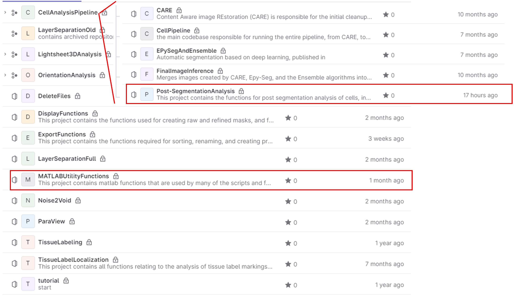
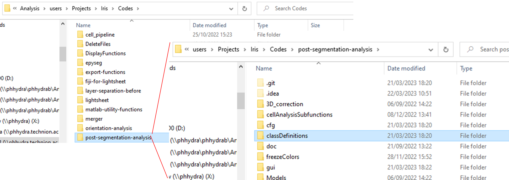
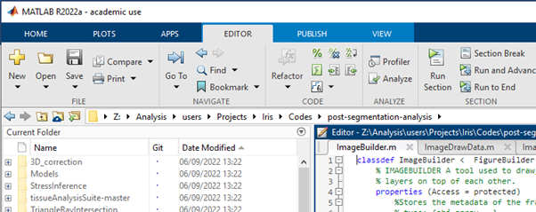
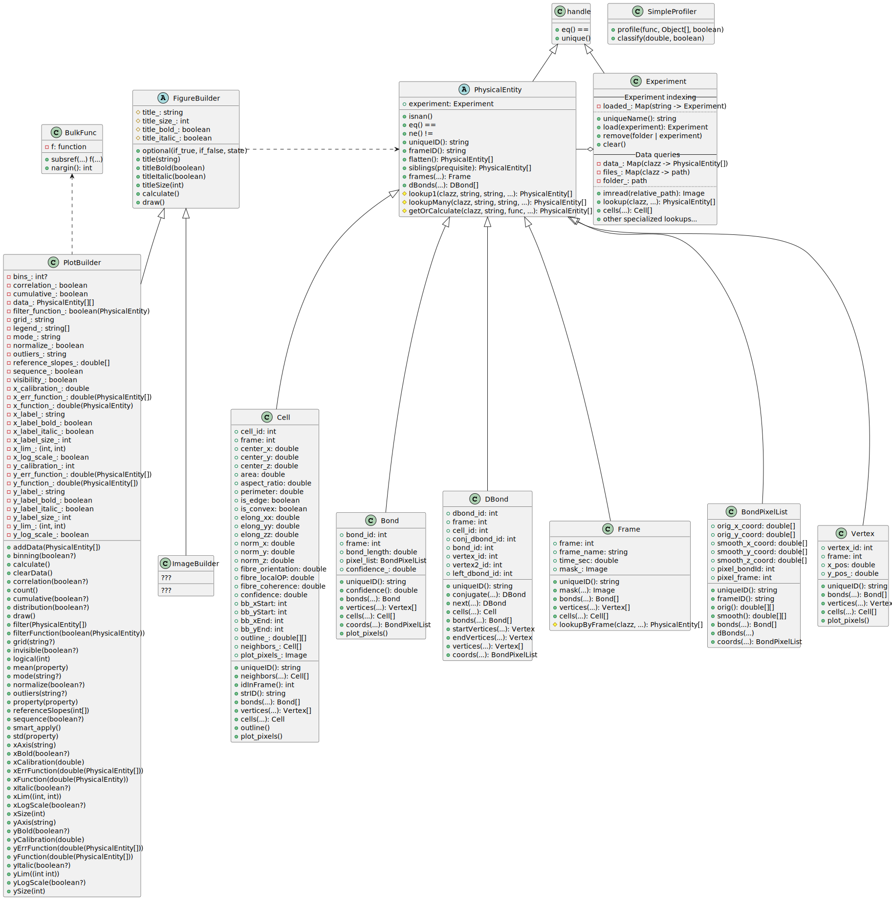
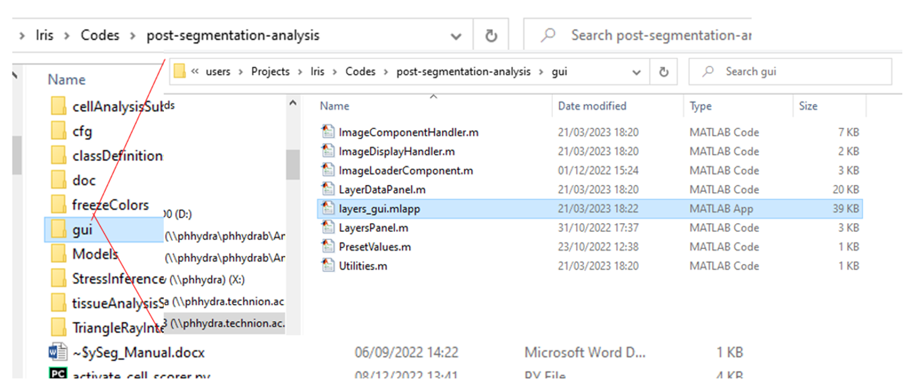
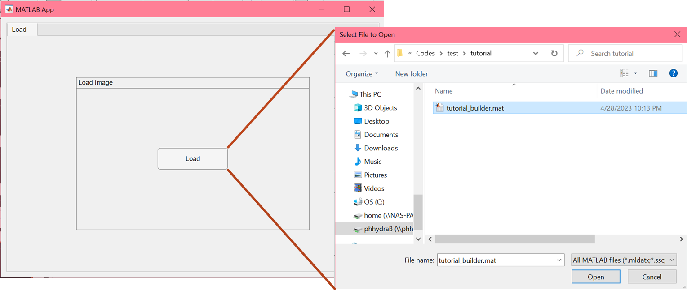

# Manual for post-segmentation analysis of cell data (geometric analysis and stress inference)

The post-segmentation analysis begins once you have a dataset of segmented images (completed according to all steps detailed in segmentation manual, ending with final segmentation image in Tissue Analyzer format – and finalized according to Lital’s manual on segmentation using Tissue Analyzer). 

The post-segmentation analysis includes two independent parts. The first is the geometric analysis. This involves extracting the information held in the output images from TA (which is purely graphical) into a suitable database for analysis. In addition, a geometric correction is applied to the data to account for the 3D geometry of our system. Creating our own analysis and visualisation enables us to analyse the data in ways that are unique to our data (for example, comparing data of cells and fibres, etc.).

The functions you will need for running the geometric analysis are:

**mainCellAnalysisData.m**

**mainPlotCellData.m** 

The second part of the post segmentation analysis is the stress inference. This is an implementation of the method and code published in https://doi.org/10.1103/PhysRevX.10.011072, code from https://github.com/nnoll/tissueAnalysisSuite. The calculation is based on using the geometries of cell boundaries to calculate relative cell boundary tensions and cell pressures in each image, assuming mechanical equilibrium. The function you will need for running the stress inference is:

**mainRunStressInference.m**

*Once each independent part of the post-segmentation analysis has been performed, the program will check whether the other part has already been performed, and if it has, the data from the separate databases will be matched (since they are initially independent). The main results of the stress inference will be copied into the data structure holding the cell geometrical data, and the unique cell ID from the geometrical data will be matched to the correct cells in the VMSI data.*

### How to get started 
####	1. Clone the following projects into your codes folder:
a.	Post segmentation analysis.

b.	Matlab utility functions.



#### 2. Open post segmentation analysis:


Make sure that in the path on the top of the page the path to your post segmentation analysis is showing:

### The pipeline for the post-segmentation analysis is as follows:
0.	Follow the instructions in manuals for segmentation using Tissue Analyzer, including the final post processing in Lital’s manual (select the PostProcess tab and press the “Finish all” button). The final folder structure should include a folder for every image frame (named according to the frame name with no file extension), and the output from TA in each folder (specifically the two .tif files needed are “handCorrection.tif” and “vertices.tif”).
####Part 1: Geometric analysis
1.	The next step is running the main script for analysing the cell data in matlab, ‘mainCellAnalysisData.m’. The script performs a few main steps, each is performed in a separate section and annotated accordingly. Notice that for analysing the data in relation to the fibres, you will need to have run the full Orientation Analysis on your data (if you are not interested in this, you can just skip sections 5-7 in the script that are relevant to the fibres). Similarly, if you are interested in relation to defect location, you will need to have marked the defect locations manually using the manual defect analysis process (details for both are in the Orientation Analysis manual). If you are using fibre orientation, you can run the full script. 

The script runs over a given list of movies and frames for each movie/dataset. If any analysis has already been performed for the movie, the new data will be added to the existing data. Frames that are included in the frame list and have already been analyzed in the past will be re-analyzed and the old data will be replaced.

The parameters you will need to change in the main analysis script are as follows:
```matlab
%% 0.1 Define mainDirList
topAnalysisDir='\\PHHYDRA\phhydraB\Analysis\users\Yonit\Movie_Analysis\'; % main folder for layer separation results
mainAnalysisDirList= { ... % enter in the following line all the output dirs for cost calculation.
    
'DefectLibrary\test1\', ...
'DefectLibrary\test2\', ...

};
for i=1:length(mainAnalysisDirList),mainDirList{i}=[topAnalysisDir,mainAnalysisDirList{i}];end
%% 0.2 Define parameters per movie

% Comment out the following irrelevant choice for framelist:
% frameList = cell(1,length(mainAnalysisDirList));
 frameList = {1:6,1:9}; % Enter specific frame ranges in this format if you
% want to run on particular frames (in this example, 1:6 is for the first
% movie, 1:9 is for the second). If left empty, runs on all frames.

calibrationXY_list = [0.65,0.52]; % um per pixel in XY plane (can be a single value or vector of length of movie list if different for each movie).
calibrationZ_list = [3,3]; % um per pixel in Z direction(can be a single value or vector of length of movie list if different for each movie).
   
useDefects_list = 1; % Set to 1 if you are using manually marked defects, and 0 if not. (can be a single value or vector of length of movie list if different for each movie).

%% 0.3 Define general parameters for analysis

umCurvWindow = (32/1.28); % Window for averaging curvature around single cell (in um). Default - 32 pixels in 1.28 um/pixel.
cellHMnum = 1; % Set to 0 or 1 according to whether the cell layer is labeled 0 or 1 in layer separation.

```
Two matlab files will be saved:

- fullCellData.mat – Matlab structure holding the information on all cells in the dataset/movie after geometric correction – includes frame, location, outline (2 and 3D), area, perimeter, aspect ratio, orientation (2 and 3D), vertices, neighbours, and data on local fibre alignment and defects. Each cell is identified with a unique ID based on the image name and numerical label given to each cell in the image (for example, "2021_06_05_pos6_T001_###", # representing the label number).
- fullVertexData.mat - matlab structure holding the information on all vertices in the dataset/movie – includes frame, location, and associated cells.

2.	To visualise the data, run the script “mainPlotCellData.m”. All parameters in section one are as in the previous script (step 1). The only additional parameter to set is the directory where the output will be saved, which should be kept consistent as already set:
``` matlab
cellPlotDir = [mainDir,'\Cells']; % Cell analysis folder for your movie/dataset, should be consistently saved here.
```
The current visualisations script includes:

* Histograms of the distribution of the following measures, per frame and over full dataset:
  *	Area
  *	Aspect ratio
  *	Perimeter 
  * Cell shape anisotropy (P/sqrt(A))
  * Relative orientation between cells and local fibres (with threshold on cell polarity and fibre coherence to include only polar cells and reliable fibre orientation).
  * Number of neighbours per cell.
  * Cell thickness – The calculation technically works, but the data from the layer separation, even if producing very good images, is not accurate enough for this to be a meaningful measure. 

* Plots of all data as function of distance from defect:
  *	Area
  *	Aspect ratio
  *	Perimeter 
  * Cell shape anisotropy (P/sqrt(A))
  * Relative orientation between cells and local fibres (with threshold on cell polarity and fibre coherence to include only polar cells and reliable fibre orientation).
  * Number of neighbours per cell.
  * Cell thickness – (see comment above)

* Plots of cell orientation overlayed on images of cells and fibres for each frame.
* Distribution of relative cell-fibre orientation for each frame as a histogram, and as a function of distance from defect.
* Plots of cell images colour-coded by area, aspect ratio, number of neighbours, cell shape anisotropy (and thickness – see comment above).
* Calculations and plots of spatial correlations of the measures listed above, currently calculated by neighbour rank (as opposed to distance – this overcomes the need to calculate distances on the curved surface, and is robust to the effect of general tissue expansions and contractions). 

### Part 2: Stress inference
This involves running just one main script: **mainRunStressInference.m**. In this case, the analysis is per movie/dataset. The parameters that need setting are: 
```matlab
mainDir='\\phhydra\phhydraB\Analysis\users\Yonit\Movie_Analysis\Labeled_cells\2021_05_06_pos6\\';
cellDir = [mainDir,'\Cells\Seg_for_training']; % Directory for cell images
segDir = [mainDir,'\Cells\Seg_for_training']; % Directory for segmentation images
cellPlotDir = [mainDir,'\Cells']; % Directory for saving output data, should be kept consistent.
calibrationXY = 0.52; % um per pixel in XY plane
calibrationZ = 3; % um per pixel in Z direction
```
The first part of the script runs a function that reads and prepares the data from the segmentation images (output from TA/EPySeg) and prepares it for the stress inference calculation. The calculation is then performed, and the following data is saved:
1.  “VMSI.m” mat file, which includes:
     1. “Struct” with the following fields:

        
        * Vdat – vertex data, includes coordinates, associated cells, bonds, and neighbouring vertices of each vertex by image frame.
        * Cdat – cell data, includes centroid, vertices, bonds, neighbouring cells, and calculated pressure per cell.
        * Bdat – bond data, includes coordinates, associated cells and vertices, radius of curvature and dual radius, calculated fit energy (how well does the original bond match the inferred bond), and calculated tension. 
        * labelMat – label matrix for this frame, with cell boundaries having 0 values, and pixels of each cell having integer values per cell.
        * ERes – 
        * PN – pressure.net class variable, which holds all mechanics info.
    2.  “PN”: Cell array holding the same information as PN field of Struct.
    3. “ERes”: Array holding the same information as the ERes field of Struct.
(These are in principle superfluous, but in the original code they are read by subfunctions that perform further calculations and plotting of the data)
       
2. tensionMaps: Folder containing plots of cell boundaries colour-coded by relative calculated tensions.

3. tension_stress_Maps: Folder containing plots of cell boundaries colour-coded by relative calculated tensions, with coarse-grained stress tensor plotted (in this case calculated per cell).

4. pressureMaps: Folder containing plots of cells colour-coded by relative calculated pressures.

* **Note on normalisation:** The tensions calculated using this method can only be calculated up to a single multiplicative factor per image frame, therefore comparison between values in different frames is not meaningful. The calculated pressures are similarly true up to the same multiplicative constant (since they are proportional to the tensions), and are also true up to an additional additive constant (which can be thought of as a baseline pressure). In this implementation, the pressures are normalized to average to 1, and which sets the scale for all tensions and pressures. For visualisation, a particular percentile threshold is set for visualising the range of values so that it captures the main variability in the data.

## Visualizing the data
There are two key components you will need to use to visualize the results you want:
- choosing the data you want to visualize
- the aspects of the data you want to see and how you want it to be presented
Each of these components have relevant objects that deal with the task.

### Loading & Manipulating physical data - PhysicalEntity
*HYDRA* has many physical things we are interested in, like the cells, bonds, etc.
However, to work with them, we need to get them from the results.

Let's start with a simple example: you want to get the average area of all the cells found in a movie.
To do this, we use this code:

```matlab
movie = Experiment.load('C:/Path/To/Cells/Directory/Cells');

target_cells = movie.cells;
cell_areas = [target_cells.area];

avg_area = mean(cell_areas);
fprintf("Mean Area = %f", avg_area);
```

Let's go over each line:
```matlab
movie = Experiment.load('C:/Path/To/Cells/Directory/Cells');
```
This line of code "loads" the movie into memory. In reality, the data of the system os stored as a bunch of tables,
which requires a lot of code to get working without errors. For this reason, `Experiment.load` is a utility function 
that already implements this code for you and simplifies the next operations using objects.

This function returns an `Experiment` instance. This represents the movie, or the experiment, as a whole. You can:
- query things stored in the movie, like cells, bonds, etc.
- You can query those things with a particular filter, accepted as an argument.
- You can do additional file operations like load images in the movie folder.

The advantage here is that the code remembers the operations you apply, so repeating operations can be done quicker.

```matlab
target_cells = movie.cells;
```
This line queries all the cells within the movie, that is, it reads the tables, figures out what are the relevant objects,
and parses them into easy to understand, and use, objects. In this case, we appropriately get an array of `Cell` objects.

`Cell` is considered a physical entity, which means:
- you can look up many aspects of this object using the functions provided.
- They can be compared (there is a NaN cell, you can check if two cells are the same, get unique entries in an array, etc.)
- some operations, instead of giving numbers and implementation specific stuff, can get you the same usable objects to make
  the code you need to write more intuitive.

```matlab
cell_areas = [target_cells.area];
```

This line gets you the area of each `Cell` in the array `target_cells`. You can run any query you want on the cells, from
simple stuff like the above, or something more complex like getting the neighbors of the cells. In the case of neighbors,
instead of getting a number, you once again get the Cell object, this time in a matrix, so you can apply additional operations on it.
For example, for a particular Cell `c`, if you want to get the total neighbor area, you can use ``sum([c.neighbors.area])``.

```matlab
avg_area = mean(cell_areas);
fprintf("Mean Area = %f", avg_area);
```

Finally, this is just regular MATLAB code used to calculate and display the mean area. Nothing special here.

The above sums up the concept of interfacing with the data API presented here.
There are many, many operations available in the code. For example, getting all the cells in the particular frames 1,2,5 can be done using
`select_cells = movie.cells(ismember([movie.cells.frame], [1,2,5]);`
Or if you want to find out which bonds border which cells, you can use
`bonds = movie.cells.bonds;`

It is a good idea to check the documentation file for each class, and they provide detailed documentation and 
explanation about each function its parameters, and the result.

### Visualizing the chosen data - FigureBuilder
Once you have the data you are interested in, you want to actually see graphs and images with the data. We offer two classes:
- `PlotBuilder`, responsible for plotting any 2D graph (line, PDF, CDF, scatter, etc.) of any 2 (or 1) aspects of the chosen data.
- `ImageBuilder`, responsible for visualizing aspects of every physical entity in particular frames. This generates an 
  actual image.

Here, we will discuss using `PlotBuilder`:

Plotting a particular graph usually involves just 3 lines of code. For example, if we want to track the mean area as a 
function of the frame, we would write
```matlab
movie = Experiment.load('C:/Path/To/Cells/Directory/Cells');

target_cells = movie.cells;

f = PlotBuilder().xFunction("frame").yFunction("area").addData(target_cells).draw;
```

We already dealt with the data loading in the previous section, here we deal with the big line here:
```matlab
PlotBuilder()
```
this constructs a new instance of `PlotBuilder`. This object is responsible for holding the instructions on how to make the graph.
This can be anything from the title of the graph to turning on logarithmic scaling, to choosing what aspects to use for the X and Y axes.
You always start here.

```matlab
.xFunction("frame").yFunction("area")
```

These two functions defines what we will see on the X and Y axes: the X axis will show the frame of the cells, and the 
Y function will calculate the area of those cells (in particular, the mean).
This may seem way too simple, as there is no code written here on *How* to get the area, but that's because `PlotBuilder`
already knows how to convert the input, "area", into a function that gets this property from the cells. This is done internally.
In cases of more complex functions, you can put those in. For example, another way to instruct the plotter to get the area for the Y axis is with
`.yFunction(@(cell) cell.area))`, which gives a "function which returns the area" as an argument.

We provided a few commonly used functions in `PlotUtils` for your convenience. Go check them out.

```matlab
.addData(target_cells)
```

This function lets the plotter know what cells it should use to actually make the plot.
In our case, these are all the cells from the movie. However, the plotter can work with any physical (and even non-physical)
entity, like bonds, defects, etc.
You can add multiple lines to the same graph using th same method, again, but with the other source cells:
`.addData(cells1).addData(cells2)`

As a side note: `addData` also allows you to give a name for the data, which is then used in the legend for th graph.

```matlab
f = ().draw;
```
This final method applies all the instructions and actually draws the graph. Nothing will happen without it.
The other method just return a new plotter with the new configurations.

Once again, it is a good idea to check the documentation file for the classes `PlotBuilder`, `ImageBuilder`, `PlotUtils`, 
since they provide detailed documentation and explanation about each function its parameters, and the result, especially since 
there are many somewhat unintuitive available operations available that make life much easier.

### Plot builder data visualization - class structure



If you want to implement new stuff, you would probably need to extend one of the existing classes for the builtin support.
- Implement `PhysicalEntity` if you want to add a new data type that exists within the *HYDRA*, like defects.
- Implement `FigureBuilder` if you want to add a new way to visualize the data mocing out of the experiments.

Each of these provides useful methods out-of-the-box, and some functions you are required to implement.
The documentation speifies what exactly they are supposed to do, and it is your job to implement the functions 
according to those guidelines.

### Plot builder data visualization - known issues

- 0-length bond: Sometimes, vertices exist right next to each other. This generates bonds with a minimal length (0). 
  These special and rare bonds do not have any directed bonds, and therefore do not have bordering cells.
  By default, we set these cells to have confidence 0, but they can cause trouble in unexpected places.
  It might be worth to still try to generate directed bonds to them.
- empty frames: some frames might have completely messed up cell images, causing them to be defunct. However, 
  we still might want to keep the frame since the fiber image might be fine. In such cases we will keep the defects, 
  but not the cells. In such cases, it might seem like there are "empty" frames.
- Vertex-less cells & bonds: sometimes, a cell does not border any other cell.
  This leads to a cell or DBond not having any vertices. In such cases, the corresponding DBond points to itself.

### Creating Image Visualizations 
Now we will discuss `ImageBuilder`. Image builder helps to visualize the cell data using layers. It can display images and markers
on top of each other (as different layers - like photoshop for instance)

There are two steps to using `ImageBuilder`:
1. Calculating the data
2. Drawing the data

They are both similar in concept to the `PlotBuilder`. 
You can also draw the images and set all the relevant settings using the GUI element.

#### Important classes:
1. `ImageBuilder.m`
2. `Experiment.m`
3. `ImageDrawData.m`
4. `ImageLayerDrawData.m`

`ImageBuilder.m` and `Experiment.m` are the classes you need to create to use the `ImageBuilder`.
The other classes are created by the ImageBuilder, but you need to set the properties to customize the visualization.

#### Creating the `ImageBuilder` and `Experiment`
Experiment:

    dir = 'Z:\Analysis\users\Yonit\Movie_Analysis\Labeled_cells\2021_05_06_pos6\Cells\'; %the directory of the cells db
    exp = Experiment(dir); %creating the experiment object
    xy_calib = 0.65; %these are different per experimnet and you need to know per microscope used.
    z_calib= 3;
    image_size = [1024,1024];
    
    % now we will set the data, done like this:
    exp.calibrationXY(xy_calib);
    exp.calibrationZ(z_calib);
    exp.imageSize(image_size);

    % or in one line (completely equivalent):
    exp.calibrationXY(xy_calib).calibrationZ(z_calib).imageSize(image_size);

For experiment, you must set the properties: calibrationXY, calibrationZ, imageSize

ImageBuilder:

    builder = ImageBuilder; %creating the ImageBuilder object
    builder.output_folder("Z:\Analysis\users\Projects\Iris\Codes\test\tutorial"); %you need to configure an output folder unless you want the image builder to save to the active matlab folder.
    builder.save_format("png"); %png or fig

For ImageBuilder, you must set the properties: output_folder, save_format

Now, you need to tell the ImageBuilder what data from the experiment you want to visualize:
You do it by using the function addData of Image builder like this:

    frame_arr= exp.frames(1:3); % you can also add a part of the frames or only one frame-> exp.frames(1) or exp.frames(1:3) or exp.frames
    builder = builder.addData(frame_arr);

The data comes from the frames attribute of the experiment.
(notice how you call the functions using the name you gave the variable when you created the class).

Now you are ready to begin.

#### Setting Layer Attributes
To set an attribute for a specific layer you do it through the layers_data function like this:

    builder.layers_data(layer_number_you_want_to_access) 

In layer_number_you_want_to_access you write the number of the layer you want to access.
This returns an `ImageLayerDrawData.m` to see what you can set type `help(ImageLayerDrawData)`.
To set something look at the functions that begin with `set____`

    builder.layers_data(number_of_layer).set______

Examples of what you can set: colormap per layer, color of layer etc.

#### Setting Image Attributes
It works the same as layer attributes, but you don't need to specify which layer (because it's just one image):

    builder.image_data.set______

To see what you can set type `help(ImageLayerDrawData)`.


#### Calculate
To be able to generate an image you need to create the layers, this is what the calculate step is for.
Meaning- to calculate the image itself you want to display, be it the pixels for a list for a marker layer.
These are the attributes you must set to be able to generate an image

    builder.layers_data(1).setClass("cells"); %in class you put one of the properties of Frame use help(Frame) to find them (you need to use the name from the methods part).
    builder.layers_data(1).setType("list");
    builder.layers_data(1).setValueFunction('perimeter'); 

The class is the attributes of want you want to draw: "cells", "bond", "vertices" etc. `help(Frame)`
The type is the type of layer you want to create:
Types of layers:
1. "list" - layer of markers 
2. "image" - an image layer
3. "quiver" - layer of quivers (arrows)

The value function is what value will be in the pixel/marker/quiver (for quiver you also need a direction).
In this case we use the perimeter of each cell to be the value. use `help(Cell/Bond/Vertex)` to find what you can use as a value,
If you don't want anything just use 1.

You can also set a filter function to filter some results:

    builder.layers_data(1).setFilterFunction("[obj_arr.is_edge]==1")

The cell object has an attribute for if the cell is on the edge. With it, we can filter to show only the cells on the edge.

You need to set these for every layer, so next you will write (if you want more than one layer):

    builder.layers_data(1).set_____

This is what you need to calculate the image. To calculate type:

    builder.calculate;

(If you want to see if it turned out alright before moving on tho the next step, type:

    builder.frame_to_draw(1).draw;
This will draw and display the first frame, and you can see if it's to your liking.
)

NOTE: YOU DON'T HAVE TO RUN THE CALCULATE FUNCTION BEFORE DRAWING FOR THE FIRST TIME.
IT WILL RUN IT FOR YOU, BUT YOU DO HAVE TO RUN IT AGAIN IF YOU CHANGED SOME OF THE PREVIOUS ATTRIBUTES AND YOU WIH TO RECALCULATE

Now the image is calculated, and we can move on to the draw part.

#### Drawing the data
There are two ways to draw the data, using code, or using the GUI.

#### Code
This works in the same way as the previous step. 
You set the layer attributes you want (`help(ImageLayerDrawData)` functions that begin with set___) or the image attributes you want (`help(ImageDrawData)`).
Example:

Layer:

    builder.layers_data(1).setMarkersColorByValue(true).setColorbar(false); 

Here, you see that for the first layer, the marker color is set to be displayed by value (using the default colormap), and that the colorbar is set to this layer.

Image:

    builder.image_data.setShowColorbar(true);
    builder.image_data.setColorForNaN([0,1,0]);

#### Saving (and loading) the Builder
Before you can use the GUI you need to save the builder.
Note: if the calculate function has been run already, it will save the calculated frames as well. 
It's meant to prevent constant recalculation, but it does make it so the save process is longer, so don't be alarmed.

You don't need to run the calculate function before saving, the GUI will run it.

Saving the builder:

    builder.saveBuilder("name_of_builder_file");

If you want to reuse a saved builder using the code:

    builder.loadBuilder("path_to_builder");

Or if you want to immediately draw: 

    builder.draw("path_to_builder");

Note that this will draw in the save format and to the output folder YOU SET FOR THE BUILDER YOU MADE IN THE CURRENT SESSION.
There is an example code in the main folder called: `exampleImageBuilder.m`, with explanations.

#### GUI
You need to have a saved builder, will all the properties to run the calculation set.

1. Opening the GUI
To open the GUI go to the `post-segmentation-analysis` folder. 
In it click on the gui `folder` and open `layers_gui.mlapp`.



2. Loading the image builder

In the gui you will be greeted by the load tab:


NOTE: IT SAYS LOAD IMAGE BUT IT MEANS LOAD IMAGE BUILDER!

This is how it should look like when the image has been loaded:

(Image tob should appear, first frame should appear)

3. Editing the image

Now just edit all the fields you see in the image tab:


You can drag the slider on the bottom to select which frame to display.
You can edit different layers in the layers Panel.
You can redraw the image to see the changes you made using the draw button.
You can save the images using the save button.


