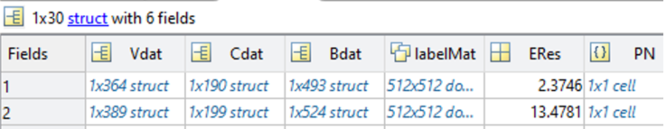

# Manual for post-segmentation analysis of cell data (geometric analysis and stress inference)

The post-segmentation analysis begins once you have a dataset of segmented images (completed according to all steps detailed in segmentation manual, ending with final segmentation image in Tissue Analyzer format – and finalized according to Lital’s manual on segmentation using Tissue Analyzer). 

The post-segmentation analysis includes two independent parts. The first is the geometric analysis. This involves extracting the information held in the output images from TA (which is purely graphical) into a suitable database for analysis. In addition, a geometric correction is applied to the data to account for the 3D geometry of our system. Creating our own analysis and visualisation enables us to analyse the data in ways that are unique to our data (for example, comparing data of cells and fibres, etc.).

The functions you will need for running the geometric analysis are:

**mainCellAnalysisData.m**

**mainPlotCellData.m** 

The second part of the post segmentation analysis is the stress inference. This is an implementation of the method and code published in https://doi.org/10.1103/PhysRevX.10.011072, code from https://github.com/nnoll/tissueAnalysisSuite. The calculation is based on using the geometries of cell boundaries to calculate relative cell boundary tensions and cell pressures in each image, assuming mechanical equilibrium. The function you will need for running the stress inference is:

**mainRunStressInference.m**

*Once each independent part of the post-segmentation analysis has been performed, the program will check whether the other part has already been performed, and if it has, the data from the separate databases will be matched (since they are initially independent). The main results of the stress inference will be copied into the data structure holding the cell geometrical data, and the unique cell ID from the geometrical data will be matched to the correct cells in the VMSI data.*


### The pipeline for the post-segmentation analysis is as follows:
0.	Follow the instructions in manuals for segmentation using Tissue Analyzer, including the final post processing in Lital’s manual (select the PostProcess tab and press the “Finish all” button). The final folder structure should include a folder for every image frame (named according to the frame name with no file extension), and the output from TA in each folder (specifically the two .tif files needed are “handCorrection.tif” and “vertices.tif”).
####Part 1: Geometric analysis
1.	The next step is running the main script for analysing the cell data in matlab, ‘mainCellAnalysisData.m’. The script performs a few main steps, each is performed in a separate section and annotated accordingly. Notice that for analysing the data in relation to the fibres, you will need to have run the full Orientation Analysis on your data (if you are not interested in this, you can just skip sections 5-7 in the script that are relevant to the fibres). Similarly, if you are interested in relation to defect location, you will need to have marked the defect locations manually using the manual defect analysis process (details for both are in the Orientation Analysis manual). If you are using fibre orientation, you can run the full script. 

The parameters you will need to change in the main analysis script are as follows:
```matlab
mainDir='\\phhydra\phhydraB\Analysis\users\Yonit\Movie_Analysis\Labeled_cells\2021_05_06_pos6\'; % Main directory for movie you are analysing.
cellDir = [mainDir,'\Cells\']; % Cell directory for movie (this is our normal folder structure and should stay consistent).
segDir = [cellDir,'Seg_for_training']; % Segmentation folder.
maskDir =  [mainDir,'\Display\Masks']; % Folder with masks for 
 
expName = '2021_05_06_pos6';
calibrationXY = 0.52; % um per pixel in XY plane
calibrationZ = 3; % um per pixel in Z direction
umCurvWindow = (32/1.28); % Window for averaging curvature around single cell (in um). Default - 32 pixels in 1.28 um/pixel.
cellHMnum = 1; % Set to 0 or 1 according to whether the cell layer is labeled 0 or 1 in layer separation.
 
% Window for orientation, local OP and coherence
orientWindow = 20/calibrationXY; % Average cell radius in um, divided by calibrationXY
cohWindow = 40/calibrationXY;
OPWindow = 20/calibrationXY;
 
useDefects = 0; % Set to 1 if you are using manually marked defects, and 0 if not.

```

Two matlab files will be saved:

- fullCellDataMod.mat – Matlab structure holding the information on all cells in the dataset/movie after geometric correction – includes frame, location, outline (2 and 3D), area, perimeter, aspect ratio, orientation (2 and 3D), vertices, neighbours, and data on local fibre alignment and defects.
- fullVertexData.mat - matlab structure holding the information on all vertices in the dataset/movie – includes frame, location, and associated cells.

2.	To visualise the data, run the script “mainPlotCellData.m”. All parameters in section one are as in the previous script (step 1). The only additional parameter to set is the directory where the output will be saved, which should be kept consistent as already set:
``` matlab
cellPlotDir = [mainDir,'\Cells']; % Cell analysis folder for your movie/dataset, should be consistently saved here.
```
The current visualisations script includes:

* Histograms of the distribution of the following measures, per frame and over full dataset:
  *	Area
  *	Aspect ratio
  *	Perimeter 
  * Cell shape anisotropy (P/sqrt(A))
  * Relative orientation between cells and local fibres (with threshold on cell polarity and fibre coherence to include only polar cells and reliable fibre orientation).
  * Number of neighbours per cell.
  * Cell thickness – The calculation technically works, but the data from the layer separation, even if producing very good images, is not accurate enough for this to be a meaningful measure. 

* Plots of all data as function of distance from defect:
  *	Area
  *	Aspect ratio
  *	Perimeter 
  * Cell shape anisotropy (P/sqrt(A))
  * Relative orientation between cells and local fibres (with threshold on cell polarity and fibre coherence to include only polar cells and reliable fibre orientation).
  * Number of neighbours per cell.
  * Cell thickness – (see comment above)

* Plots of cell orientation overlayed on images of cells and fibres for each frame.
* Distribution of relative cell-fibre orientation for each frame as a histogram, and as a function of distance from defect.
* Plots of cell images colour-coded by area, aspect ratio, number of neighbours, cell shape anisotropy (and thickness – see comment above).
* Calculations and plots of spatial correlations of the measures listed above, currently calculated by neighbour rank (as opposed to distance – this overcomes the need to calculate distances on the curved surface, and is robust to the effect of general tissue expansions and contractions). 

### Part 2: Stress inference
This involves running just one main script: **mainRunStressInference.m**. The parameters that need setting are: 
```matlab
mainDir='\\phhydra\phhydraB\Analysis\users\Yonit\Movie_Analysis\Labeled_cells\2021_05_06_pos6\\';
cellDir = [mainDir,'\Cells\Seg_for_training']; % Directory for cell images
segDir = [mainDir,'\Cells\Seg_for_training']; % Directory for segmentation images
cellPlotDir = [mainDir,'\Cells']; % Directory for saving output data, should be kept consistent.
calibrationXY = 0.52; % um per pixel in XY plane
calibrationZ = 3; % um per pixel in Z direction
```
The first part of the script runs a function that reads and prepares the data from the segmentation images (output from TA/EPySeg) and prepares it for the stress inference calculation. The calculation is then performed, and the following data is saved:
1.  “VMSI.m” mat file, which includes:
     1. “Struct” with the following fields:

        
        * Vdat – vertex data, includes coordinates, associated cells, bonds, and neighbouring vertices of each vertex by image frame.
        * Cdat – cell data, includes centroid, vertices, bonds, neighbouring cells, and calculated pressure per cell.
        * Bdat – bond data, includes coordinates, associated cells and vertices, radius of curvature and dual radius, calculated fit energy (how well does the original bond match the inferred bond), and calculated tension. 
        * labelMat – label matrix for this frame, with cell boundaries having 0 values, and pixels of each cell having integer values per cell.
        * ERes – 
        * PN – pressure.net class variable, which holds all mechanics info.
    2.  “PN”: Cell array holding the same information as PN field of Struct.
    3. “ERes”: Array holding the same information as the ERes field of Struct.
(These are in principle superfluous, but in the original code they are read by subfunctions that perform further calculations and plotting of the data)
       
2. tensionMaps: Folder containing plots of cell boundaries colour-coded by relative calculated tensions.

3. tension_stress_Maps: Folder containing plots of cell boundaries colour-coded by relative calculated tensions, with coarse-grained stress tensor plotted (in this case calculated per cell).

4. pressureMaps: Folder containing plots of cells colour-coded by relative calculated pressures.

* **Note on normalisation:** The tensions calculated using this method can only be calculated up to a single multiplicative factor per image frame, therefore comparison between values in different frames is not meaningful. The calculated pressures are similarly true up to the same multiplicative constant (since they are proportional to the tensions), and are also true up to an additional additive constant (which can be thought of as a baseline pressure). In this implementation, the pressures are normalized to average to 1, and which sets the scale for all tensions and pressures. For visualisation, a particular percentile threshold is set for visualising the range of values so that it captures the main variability in the data.

