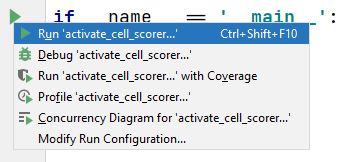
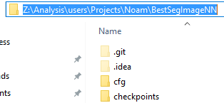

# The Cell Scorer
As sophisticated as the cell pipeline is, 
it is far from perfect. It marks many "false cells".

The cell scorer allows us to filter the cell candidates 
found by the cell pipeline using a confidence score.

The main instructions here will cover the general
steps that need to be performed,
and the specific method selected for current work.

## Operation

### Work Directory Hierarchy

Assuming you ran [the Refined EPy-Seg](https://techgit.technion.ac.il/hydra/geo_cell/epyseg),
your work directory should be arranged as follows:
```
Z:/ ... 
- Cells    <-- this is your work directory
  - CARE_ensemble
    - ...
  - Raw Cortices
    - ...
  - Inference
    - {model folder}
      - img_0
        - handCorrection.tif
      - ...
      - img_0.tif
      - ...
- Display
  - Masks
    - ...
```

Make sure you know where your work directory is
(should be under your user folder, in
`Movie_Analysis/Labeled_Cells/<DATE_POS>/Cells`),
and whether you want to train a new model or (the usual) run an existing model.

### Prep work

Before we can do anything with the scorer,
we need to use the segmentation and generate a database
of the cells in the video.

#### Tissue-Analyser Post-Process
The first step, which is the only "truly manual" step,
involves ImageJ's "Tissue Analyzer" plugin.

1. Open ImageJ, which should be available in the toolbar,
From there, open the plugin tab and scroll down to Select
`Tissue Analyzer`.

   

2. This will open a new window for you 
   with multiple options. First, drag the inferred model folder
   (`Inference/{model folder}`) into the window.
   
   
   
3. Open the `PostProcess` tab and click on `Finish All`.

   

4. Click "OK" on the popup without clicking on anything else

   

As a result, each folder within the model folder in `Inference` now
has several additional files:

```
- {model folder}
  - img_0
    - handCorrection.tif
    - boundaryPlotter.tif
    - cell_identity.tif
    - vertices.tif
    - TA.db
  - ...
```

**IF YOU ARE TRAINING A NEW MODEL**, 
each image here should also have a ground truth variant.
Name it `groundTruth.tif` and manually move it to the cortex
folder (per cortex)

#### Collect cell data in `fullCellData.mat`

From this point on, we run scripts available in this repository.
Run the MATLAB script `mainCellAnalysisData.m`.
You can learn more about how to run this script in
`README.md`.

The important part is that after running it, you will find
a new file, called `fullCellData.mat`, in the work directory.

#### Generate cell database

The final prep piece is to generate images for our system
to categorize. We do this using the script `runGenCellDB.m`

The initial part of the file contains parameters you might want to change:

```matlab
addpath(genpath('\\phhydra\phhydraB\Analysis\users\Projects\Noam'));

mainDir='Z:\Analysis\users\Projects\Noam\Workshop\\timepoints'; % Main directory for movie you are analysing.
cellDir = [mainDir,'\Cells\']; % Cell directory for movie (this is our normal folder structure and should stay consistent).
segDir = [cellDir,'Inference\2021_10_12_CEE3_CEE5_CEE1E_CEE1E_CEE6']; % Segmentation folder.

training=false
```

- `genpath` adds sub-programs available 
  in your personal work directory.
  
- `mainDir` refers to the parent of the "work directory"
- `cellDir` is the work directory
- `segDir` is the `Inference/{model folder}` directory.
- `training` is an indicator for whether to generate the cell database
  in preparation for training or activation

Once you change those to the relevant parameters, 
you can run the file.

This file will generate a whole new folder 
in the work directory - `CellDB`:

```
- Cells
  - CellDB
    - cells
      - cell_0
      - ...
    - fakes (training mode only)
      - cell_1
      - ...
    - unclassified (training mode only)
      - cell_2
      - ...
    - summaries (training mode only)
      - cortex_0
      - ...
  - ...
```

- `cells` contains all the cells. When in training mode,
  it contains all the cells that are similar enough to the
  ground truth
  
- `fakes` contains all cells that are far too different
  from the ground truth. This exists only in training
  
- `unclassified` contains all cells the generator is unsure of
  it is the middle ground between being blatantly fake
  to being a true cell with some correction.
  
- `summaries` collects the information about all the cells
  in each cortex into a useful visual summary. This
  image can give a gist into how well the cell pipeline
  (up to the scorer) performed.
  This only exists in training.

### Use an existing model to add the scores

1. open `cfg/config.yml` in your preferred editor.
   This is a configuration file used to set parameters
   for all scripts.
   search for `activation`, and under it, there should be
   a `work_dir` variable. Replace the value of `work_dir`
   with the path to your work directory.
   ```yaml
   activation:
     work_dir: <some path>
   ```
   You can get the path
   from the file explorer by clicking on the box containing
   the parent directories (called breadcrumbs) and copying the result

   

2. **Running from PyCharm**:

   Open this folder in PyCharm, and open the file `activation.py`.
   At the very bottom of the file, find the following code fragment:
   ```python
   if __name__ == '__main__':
       main()
   ```
   There should be a 'run' button in the gutter next to it.
   Click on it, and then on `Run 'activate_cell_scorer'`:

   

3. **Running from Command Line**:

   Find and copy the path of this directory. You can use the same breadcrumb method like before.

   

   Open command prompt.
   To do so, you can either search for it manually,
   or press `Win+X` then `C`

   

   Then, run
   ```commandline
   Z:
   cd <PATH>
   activate cell_scorer
   python activate_cell_scorer.py
   ```
   where `<PATH>` is the path to the directory you copied
   earlier.

   

   The script should be running now, with the log visible on command prompt.

### Train a new scoring model

0. **Prepare data for training:**

   First, to do any sort of training, you will need a hand segmented image
   per automatically trained image.
   
   Follow the steps in the "prep work" section with the mindset of training.
   This means adding the ground truth to each folder, and running `runGenCellDB.m`
   with `training=true`.

1. open `cfg/config.yml` in your preferred editor.
   This is a configuration file used to set parameters
   for all scripts.
   search for `training`, and under it, there should be
   a `work_dir` variable. Replace the value of `work_dir`
   with the path to your work directory.
   ```yaml
   training:
     work_dir: <some path>
     output_format: <some format>
     data_sources:
     - <a list of paths>
   ```
   You can get the path
   from the file explorer by clicking on the box containing
   the parent directories (called breadcrumbs) and copying the result

   

   There are other variables you might be interested in,
   like `data_sources` which sets the paths to the folders containing
   the cropped, categorized cells.

2. **Running from PyCharm**:

   Open this folder in PyCharm, and open the file `train_cell_scorer.py`.
   At the very bottom of the file,
   find the following code fragment:
   ```python
   if __name__ == '__main__':
       main()
   ```
   There should be a 'run' button in the gutter next to it.
   Click on it, and then on `Run 'train_cell_scorer'`:

   

3. **Running from Command Line**:

   Find and copy the path of this directory.
   You can use the same breadcrumb method like before.

   

   Open command prompt.
   To do so, you can either search for it manually,
   or press `Win+X` then `C`

   

   Then, run
   ```commandline
   Z:
   cd <PATH>
   activate cell_scorer
   python train_cell_scorer.py
   ```
   where `<PATH>` is the path to the directory you copied
   earlier.

   

   The script should be running now,
   with the log visible on command prompt.

4. Once the program is complete,
   you will find the newly created model
   in the path specified by the config file,
   under the variable `output_format`.
   This is probably `Models/<date>_<models>.pth`

## Parameters
All the parameters are stored in `cfg/config.yml`.
We will describe each parameter and its application in this section.


### General Parameters

- **work_dir**:
  
  *type*: `(absolute) path`
  
  *default*: if not set, all other paths must be absolute. 
  
  The absolute path to the working directory. 
  While this does nothing alone, this parameter 
  sets a useful anchor for other path parameters. 
  You should change this value each time you change a dataset.

- **data_sources**:
  
  *type*: `List of paths (with glob support)`
  
  *default*: `[] (an empty list)`
  
  A list of "second level" folders containing the images of individual cells. 
  These are absolute or relative paths from the work directory 
  to the target folders.
  
  For example, if `mainGenCellDB` generated the following layout:
  ```
  CellDB
  - cells
    - img_0.png
    - img_1.png
      ...
  - fakes
    - img_2.png
    - img_3.png
      ...
  ```
  then you would specify the relative (or absolute) path to `CellDB`.

  This parameter supports glob formatting,
  which is a user-friendly way
  to express many paths with one expression.
  The program is also smart and will add subdirectories if
  the path specified does not contain images directly.
  
- **stretch_level**:

  *type*: `integer`
  
  *default*: `0`

  Most cells do not perfectly fit into a square canvas with the original input size of the network (224*224).
  We solve this by applying a geometric transformation on 
  the image to make it fit.
  
  We implemented several algorithms. 
  You can choose which one to use by changing 
  the value of this parameter:
  - `0` means no stretching, but instead add black padding with the cell at the center.
  - `1` means rescale the cell to the correct size and add padding to make it square
  - `2` means stretch the cell to be exactly the square
  
  In the activation section, make sure to 
  match this value to the one used in the model.

### Activation Specific

- **table_format**:

  *type*: `path (with template macros)`

  *default*: `{source}/../fullCellDataMod.mat`

  The path, either absolute or relative to the work
  directory (or corresponding source directory), 
  indicating where each source directory's 
  cell table is located. 
  The program also automatically recognizes the
  following and replaces them:

  - `{date}` is replaced with the current date in
    YYYY_MM_DD format

  - `{source}` can be placed at the start of the path to 
    indicate that the path is relative from each source 
    directory instead of relative from the work directory.

  - `/` allows adding sub-directories in the output path.
    works like you would expect.
    
  - `..` allows you to specify paths relative to the 
    parent directory. Works like you would expect.

- **model**:
  
  *type*: `path`

  *default*: None.

  the absolute or relative path from the home directory of 
  **this python script** to the model file used to process the data. 
  This should stay untouched since the model 
  changes very infrequently.

### Training Specific

- **output_format**:

  *type*: `path (with template macros)`
  
  *default*: `Models/{date}_{models}`

  The path, either absolute or relative to the work
  directory, indicating where the output files will
  be placed.
  The target directory does not have to exist,
  as the program will create it for you.
  The program also automatically recognizes the
  following and replaces them:

  - `{date}` is replaced with the current date in
    YYYY_MM_DD format
    
  - `{models}` is replaced with a shortened list of the
    models that generated the data sources
    (for example, EE3_EE5).

    Note that this is only an attempt at making a
    short & descriptive model name,
    it might be better to write one by hand.

  - `/` allows adding sub-directories in the output path.
    works like you would expect.
    
- **ground_truth_dir**:

  *type*: `path`
  
  *default*: None.

  The absolute or relative path from the work directory to
  where the ground truth of the training images are.
  the directory specified must contain image names
  that match those provided in the data sources.
  This might change from time to time.
  
- **num_epochs**:

  *type*: `integer`
  
  *default*: `50`

  number of epochs, or training cycles the trainer goes
  through.
  between every two epochs,
  to ensure we reach the best case scenario,
  the system randomizes the weights a little.
  This can yield better results,
  but requires more training time.
  
- **initial_learning_rate**:

  *type*: `float`
  
  *default*: `0.0005`

  the learning rate is a tuning parameter describing how big the change in the weights can be. 
  Since we use an optimizer within the code (SGM), 
  the learning rate changes over time.
  
- **momentum**:

  *type*: `float`
  
  *default*: `0.9`

  a factor that causes the learning rate to change based 
  on how quickly the parameters change during training. 
  This is a very niche parameter to change but can 
  speed up the process if done right.
  
- **lr_decay_step**:

  *type*: `integer`
  
  *default*: `7`

  to allow the earlier epochs to do significant changes, 
  we decrease the learning rate throughout the epochs

  this parameter specifies how often to reduce this learning rate

- **lr_decay_size**:

  *type*: `float`
  
  *default*: `0.1`

  to allow the earlier epochs to do significant changes,
  we decrease the learning rate throughout the epochs.

  Each time the learning rate is reduced, 
  by what factor should it be reduced?
  
- **valid_ratio**:

  *type*: `float`
  
  *default*: `0.05`

  The percent of the available data that will be
  dedicated to validation rather than training.
  Having more images for validation
  can give better feedback on how good the model is,
  but risks under-fitting.
  Having fewer images for validation can result
  in a better model,
  but risks over-fitting.
  A widely accepted value for this parameter is `0.1`.
  
- **flag_unclassified**:

  *type*: `integer`
  
  *default*: `-1`

  Most cell databases do not perfectly classify 
  all cells into "fakes" and "cells".
  Such cells are "unclassified". Using this setting, 
  you can choose how the trainer will consider these cells.
  - `-1` means ignore them completely from training
  - `0` means treat them as fakes
  - `1` means treat them as cells

## Technical Overview

### The Model

In short, we use a pretrained SE_ResNeXt50 CNN,
which we trained on our data for binary classification.

#### Model

- The model is a well known classification neural network,
  that is, its job is to decide what is being shown in the image
  in its entirety, without any context of *where*.
- CNN, or Convolutional Neural Network, 
  simply means the network uses convolution layers, which are commonplace
  in computer vision.
- SE_ResNeXt refers to two iterations of improvements made on the original
  classification CNN, called [ResNet](https://arxiv.org/abs/1512.03385) (Residual Network):
  - [ResNeXt](https://arxiv.org/abs/1611.05431) aggregated multiple ResNets together
  - SE refers to [Squeeze and Excitation](https://arxiv.org/abs/1709.01507), 
    which adds a parameter that can adapt the weight of each module
    over time.
- the model uses 50 layers total, 
  which is a standard for this class of problems
- we downloaded an existing model from the [pretrainedmodels](https://github.com/Cadene/pretrained-models.pytorch) 
  repository, which
  was pre-trained on a large image set, ImageNet.
  We re-trained it on our cells. Research shows doing this
  drastically improves performance.

#### Loss & Learning

- We use the standard loss model or binary classification
  called (binary) cross entropy
- we optimise using [SGD](https://pytorch.org/docs/stable/generated/torch.optim.SGD.html), with:
  - initial learning rate: 0.01
  - momentum: 0.9
- we reduce the learning rate over time using a 
  [decay LR scheduler](https://pytorch.org/docs/stable/generated/torch.optim.lr_scheduler.StepLR.html), with:
  - decay step: 7
  - decay size: 0.1
  
#### Misc.

- 5% of the valid images went into validation
- We aggregated the images using random flips, 
  90 degree rotations, and transposes
  (these just give us all 8 orthogonal orientations)
- we ignored unclassified images during training
- we stretched our images to fit the 224x224 canvas
  without conserving the aspect ratio (algorithm 2)
- We trained the model for 50 epochs

#### Results

- **Accuracy**: 87.8431% on the validation set (88.07% on training)
- **False Positives**: 6.8071%
- **False Negatives**: 5.4339%

From a preliminary examination, it seems the scorer has no bias.

### Program Structure

We used pytorch as the core library for the network.
The code consists of five classes, each with a single responsibility:


- `model_loader` loads the custom model class from the internet

- `scorer_dataset.ScorerDataset` is the data representation of the
input/output of the neural network and is responsible for
piping data from the source image files specified by the config into the NN.

- `smart_config.SmartConfig` is responsible for
parsing the configuration file into usable and meaningful python variables.

- `activate_cell_scorer.py/train_cell_scorer.py` are the modules that
run the tasks.
They are responsible for linking the other classes
together and using them appropriately.

Following is a useful graph describing the relationship between
the core libraries of the program:


## Further Work

### Adding New Configurations
To add a new configuration, you need to allow the program,
specifically `SmartConfig`, to read the corresponding parameter
from `config.yml` and save it within itself.

For example, let's say we want to add a parameter called `my_param`
with a string value.

1. Add it in the actual config file to the corresponding sections.
   For example, to add it to the activation script, we do
   ```yaml
   activation:
     my_param: my_value
   ```
2. Add the configuration in `SmartConfig`. To do so,
   add it with a basic value in the `__init__` function:
   ```python
   def __init__():
       self.my_param: str = ''
   ```
3. Link the value in the config into the value in python using
   `SmartConfig#load()`. This method is responsible for
   reading the yaml file (stored in `raw`) and put it in `self`.

   You will need to add code to copy the value from `raw` to `self`
   (and potentially more context sensitive stuff like append the work_dir path)

   For instance:
   ```python
   def load(rel_path: str):
       ...
       self.my_param = raw['my_param']
   ```

   If the parameter is only available in training,
   make sure to place it in

   `if self._section == 'training': ...`

   If the parameter is only available in activation,
   make sure to place it in

   `if self._section == 'activation': ...`

   Finally, you can use `self.to_absolute(work_dir, <PATH>)`
   to convert a path to a path potentially relative to the work directory.

### Model Improvements

We did not train the model using the optimal conditions.
We had the following issues:
- Our sample size consists of ~35k images, when industry standard
  refers to ~300k images
- When we tried to use a 101 layered network, 
  it over-fitted very quickly.
  
We can probably increase the accuracy of our system by a 
significant margin if we do the following:
- increase sample size (requires a lot of manual segmentation), 
  which could enable the 101 layer variant in the future
- Use the tips from the [Cancer Research Kaggle](https://www.kaggle.com/c/histopathologic-cancer-detection/discussion/81747) to 
  improve performance
- fine-tune critical parameters in the training
  (i.e. momentum and decay)
- find additional ways to augment the dataset
  (for example distortion)
- increase number of epochs used for training